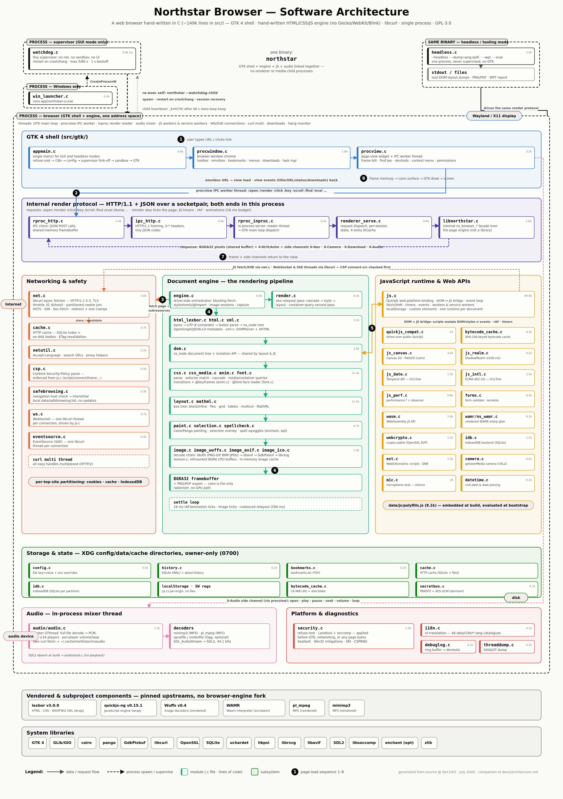

# Northstar architecture



This document maps the Northstar codebase: the process model, the
page-load pipeline, and which source file owns which job. It describes the
**minimalist GPL edition**, which is single-process and hand-written (no
forked browser engine). For the security posture of each layer see
[`../SECURITY.md`](../SECURITY.md).

## Process model

This edition runs the engine **in one process**. There is no per-tab or
per-origin renderer process; every page shares one address space.

```
 watchdog supervisor  (watchdog.c)
    │  spawns + restarts on crash/hang
    ▼
 browser process  (src/gtk/ shell + engine, single-process)
    │   ├─ GTK 4 UI: one page view, omnibox, menus  (src/gtk/*.c)
    │   ├─ engine: fetch → parse → style → layout → paint
    │   ├─ QuickJS runtime for the current top-level page
    │   └─ asynchronous audio worker           (src/audio/audio.c)
    │          <audio> decode (minimp3 / pl_mpeg / opus / vorbis) → SDL2
    │   └─ <video> decode: MPEG-1 via pl_mpeg           (src/video.c)
    │
    └─ no renderer or media child processes
```

- **Watchdog supervisor** (`watchdog.c`) — a normal GUI launch first
  becomes a tiny supervisor that runs the real shell as a child and
  restarts it on crash or hang. It initialises no network, sandbox, or
  UI. Headless/tooling modes are never supervised.
- **Browser process** — the GTK 4 shell (`src/gtk/`) hosts the engine
  directly. `ns_rproc_single_process_enable()` (`rproc_inproc.c`) wires
  the in-process render path so no renderer subprocess is spawned.
- **Audio mixer** (`src/audio/audio.c`) — downloads and decodes `<audio>`
  on an in-process worker thread, then outputs through SDL2. Per-view audio
  contexts keep page state separate.

A single internal HTTP/JSON request protocol (`renderer_serve.c`,
`rproc_http.c`, framed by `ipc_http.c`) still describes each render as a
request/response; in single-process mode both ends live in the one process
(`rproc_inproc.c`), and the same protocol is what a headless dump drives.
`libnorthstar.c` is the page-engine host both the renderer and the headless
driver call — an internal interface, not the embeddable library API, which
this edition does not carry.

## Page-load pipeline

Each navigation flows through these stages. The engine is synchronous
once bytes are in hand (`engine.c`, `render.c` orchestrate it; the GUI
and headless drivers share the same path).

| Stage | File(s) | Job |
|-------|---------|-----|
| 1. Fetch | `net.c`, `netutil.c`, `cache.c` | libcurl async fetch (HTTP/2, HTTP/3 when available), TLS verification, redirect clamp, response-size cap, HSTS, Alt-Svc, per-site cookie jar and HTTP cache. A speculative scan preloads the parsed document's scripts and stylesheets; a preload map, an in-flight coalescer and the HTTP cache then answer in that order, all keyed on request identity rather than bare URL, so a subresource is fetched once. |
| 2. Safety gate | `safebrowsing.c`, `csp.c` | Top-level host checked against the local SHA-256 blocklist; Content-Security-Policy parsed and enforced; Subresource-Integrity verified. |
| 3. Parse | `html_lexbor.c`, `html.c`, `xml.c` | Bytes → DOM via lexbor (WHATWG HTML). `xml.c` handles XHTML/namespaced XML. Charset via uchardet. |
| 4. DOM | `dom.c` | The document tree and its mutation API, shared by layout and the JS bridge. |
| 5. Style | `css.c`, `css_syntax.c`, `css_media.c`, `anim.c`, `font.c` | Stylesheet parse, selector matching, the cascade, computed values. `css_syntax.c` is the CSS Syntax tokenizer, `css_media.c` the Media Queries Level 4 parser and evaluator. `anim.c` runs transitions and `@keyframes`; `font.c` loads `@font-face` web fonts. |
| 6. Layout | `layout.c`, `mathml.c` | Box tree and fragmentation: block/inline, flex, grid, tables, multicol, positioned boxes. Text is itemized, shaped and broken into lines by ns-pango. `mathml.c` lays out presentation MathML. Anonymous table boxes are generated around any run of table-internal siblings. |
| 7. Paint | `paint.c`, `image.c`, `texture.c` | Builds and rasterises the Cairo display list. `image.c` decodes images on demand into the `texture.c` pixel abstraction. |
| 8. Present | `src/gtk/procview.c`, `headless.c` | GUI blits the surface into the GTK widget; headless dumps it to PNG or a text/layout tree. |

Most computed values stay as parsed `ns_css_value`s, but `display` is
resolved once per element into an `ns_display` — the CSS Display Level 3
decomposition into an outer type, an inner type, a list-item flag and a
layout-internal kind. Layout, paint and the CSSOM read that value through
predicates in `css.h` rather than comparing keyword strings, and
blockification of floated and absolutely positioned boxes has a single
implementation.

Floats are tracked per block formatting context. A block that does not
establish its own context inherits the enclosing context's floats, so a
float placed in an ancestor still shortens the line boxes of nested
content. Only tables, block-level replaced elements and boxes that
establish a new formatting context are pushed aside by a float; every
other in-flow block keeps the full containing-block width and overlaps
the float, as CSS 2.1 §9.5 requires. An inline run whose lines cross the
bottom of a float is split into fragments, so the text below the float
reclaims the full width.

## JavaScript and web APIs

| Area | File(s) |
|------|---------|
| Core engine binding (QuickJS), DOM/JS bridge, most Web APIs | `js.c` |
| Compatibility shims over the public QuickJS API | `quickjs_compat.c` |
| Canvas 2D, `Path2D`, `ImageBitmap`, `DOMMatrix` | `js_canvas.c` |
| `Date`, `Intl`, `performance`, realm helpers | `js_date.c`, `js_intl.c`, `js_perf.c`, `js_realm.c` |
| `crypto.subtle` (WebCrypto over OpenSSL) | `webcrypto.c` |
| Offline Web Audio graph rendering | `webaudio.c` |
| WebAssembly JS API (over vendored WAMR) | `wasm.c`, `src/wamr/` |
| `WebSocket`, `EventSource` (SSE) | `ws.c`, `eventsource.c` |
| `getUserMedia` video: V4L2 capture and per-site permission | `camera.c` |
| Service worker registration, persistence and worker host | `js.c` |
| WebExtension manifests, resources, storage and messaging | `ext.c`, `js.c` |
| Forms: validation, serialization, submission | `forms.c` |
| Text selection on the rendered page | `selection.c` |

The DOM/JS bridge invalidates opaque node pointers on free and
re-validates them on every call, so DOM mutation cannot dangle a
JS-held handle. Pure-JS polyfills live in `data/js/polyfills.js` and are
embedded at build time (`src/meson.build`); some page-facing surfaces are
assembled there over native hooks rather than bound in C, which is why
`navigator.mediaDevices.getUserMedia` rejects until the polyfill replaces
it with the one that reaches `camera.c`. Video capture works and audio
capture does not: `mic.c` is a stub, and this edition does no audio
capture.

## Storage and state (SQLite / files)

| Concern | File |
|---------|------|
| Flat key/value configuration | `config.c` |
| HTTP cache (SQLite index + on-disk bodies) | `cache.c` |
| IndexedDB | `idb.c` |
| Browsing history | `history.c` |
| Bookmarks | `bookmarks.c` |
| Service worker registrations | `js.c` |
| WebExtension local storage | `ext.c` |
| Compiled-script bytecode | `bytecode_cache.c` |

On-disk state lives under the XDG config/data/cache directories with
owner-only permissions. See [`../SECURITY.md`](../SECURITY.md) for the
partitioning and permission model.

## Images

`image.c` decodes lazily, trying decoders in order:

1. **`image_ico.c`** — ICO, unwrapped and handed to Wuffs.
2. **Wuffs** (`image_wuffs.c`) — PNG/APNG, GIF, BMP, JPEG and still WebP
   (memory-safe, transpiled-to-C). An animated WebP is reduced to its
   first frame by walking the RIFF container, since Wuffs decodes only
   still WebP.
3. **libavif** (`image_avif.c`) — AVIF, when built with it.
4. **`svg.c`** — SVG, rendered in-engine onto Cairo.

Nothing follows. A format none of these cover fails to decode rather
than falling through to a plugin-loaded decoder.

## Video

`<video>` plays MPEG-1 and nothing else. `video.c` recognises an MPEG-1
Program Stream or elementary video stream by its start code and decodes
every frame up front through the vendored pl_mpeg, which already supplies
the MP2 audio decoder — so video costs no dependency the tree did not
already carry, and MPEG-1's patents have expired.

Decoded frames become the same `ns_image_pixel_frame` list an animated
GIF produces, so the image cache's fetch, frame timing, repaint
scheduling and eviction serve video unchanged, and `paint_video` draws
the current frame where it used to draw a placeholder.

The media element API drives that timeline rather than sitting beside it.
`ns_image_anim_duration`, `ns_image_anim_position`,
`ns_image_anim_set_paused` and `ns_image_anim_seek` are the whole of the
playback surface, and `duration`, `readyState`, `paused`, `play()`,
`pause()` and `currentTime` in `src/js.c` resolve through them by looking
the element's source up in the image cache. Because that cache is keyed by
URL, two `<video>` elements with the same source share one timeline. A
clip autoplays and loops; it carries no audio, so this is the muted
autoplay browsers already permit, and there is no controls UI to start it
by hand. One consequence of
decoding up front is that a clip is bounded rather than streamed: decoding
stops at `NS_VIDEO_MAX_FRAMES` frames or `NS_VIDEO_MAX_TOTAL_BYTES`
(256 MB) of decoded pixels, whichever comes first, and a longer clip plays
its prefix.

MPEG-1 is not a format the modern web serves. This is video for local and
self-hosted clips; streaming sites need adaptive streaming over Media
Source Extensions and a modern codec, neither of which this edition has.

## Security-relevant modules

| File | Role |
|------|------|
| `security.c` | Refuse privileged startup, Linux Landlock + seccomp sandbox, macOS Seatbelt profile, Windows process mitigations. |
| `csp.c` | Content-Security-Policy parse and enforcement, per document. |
| `safebrowsing.c` | Local phishing/malware blocklist + interstitial. |
| `watchdog.c` | Supervisor that restarts the browser on crash or hang. |

## Third-party components

Fetched by `meson setup` as pinned subprojects: **lexbor** (HTML/CSS/URL),
**quickjs-ng** (JS) and **ns-pango** (text itemization, shaping and line
breaking). Vendored in-tree: **Wuffs** (images), **pl_mpeg** (MPEG-1 video
and MP2 audio), **WAMR** (WebAssembly, `src/wamr/`) and **minimp3** (MP3,
`src/audio/minimp3.h`). See [`../THIRD-PARTY-LICENSES.md`](../THIRD-PARTY-LICENSES.md).

ns-pango is a Pango fork that exists for one reason: stock Pango keeps no
cache outliving a `PangoLayout`, so the same bytes were shaped once to
measure a run and again to paint it. The fork adds a process-wide cache of
finished glyph strings and a per-context metrics cache. Every symbol in it
is renamed (`ns_pango_*`, `NsPango*`), because GTK loads the system Pango
into the same process and GObject aborts if two libraries register the same
type name — so the engine includes `<ns-pango/…>` and the GTK shell keeps
using the system Pango for its own widgets. A run is cached only when its
shaping cannot depend on the text around it, which means whitespace or a
paragraph edge at each end; `NS_PANGO_SHAPE_CACHE=verify` shapes both ways
and warns on any difference, and `NS_PANGO_SHAPE_CACHE=0` disables it.

## Diagnostics

`debuglog.c` is the in-process log ring the JS console and the `--debug`
flag both read. `--debug=info,warn,error,render,net,js` selects levels,
`--debug` alone selects all of them, and `net` is where ns-pango reports
shape-cache hits, misses and skips. `threaddump.c` dumps every thread to
stderr, on demand or from a `SIGQUIT`.

## UI translation

UI strings are English-source and translated at startup by an in-tree
catalogue lookup (`i18n.c`, `data/i18n/*.lang`). English is the fallback
for any string a catalogue does not cover. There is no gettext dependency.
