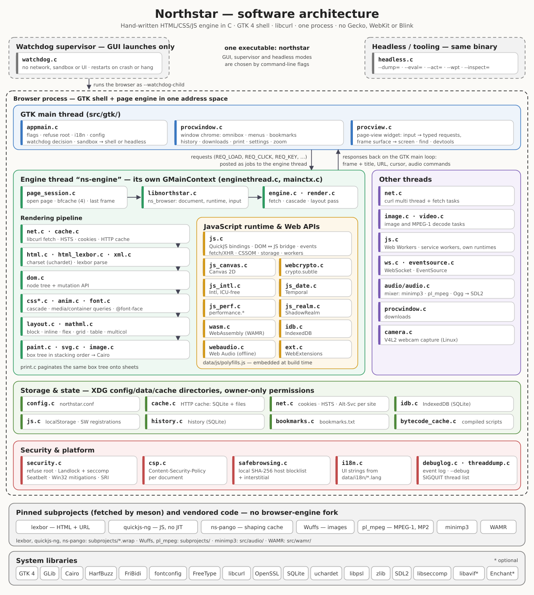

# Northstar architecture



This document maps the Northstar codebase: the process and thread model,
the page-load pipeline, and which source file owns which job. It describes
the **minimalist GPL edition**, which is single-process and hand-written
(no forked browser engine). For the security posture of each layer see
[`../SECURITY.md`](../SECURITY.md).

## Process model

This edition runs the engine **in the shell process**. There is no
per-tab or per-origin renderer process; every page shares one address
space.

```
 watchdog supervisor  (watchdog.c, GUI launches only)
    │  re-executes the binary with --watchdog-child,
    │  restarts it on crash or hang, restores the session
    ▼
 browser process  (appmain.c → src/gtk/)
    ├─ GTK main thread: window, omnibox, menus, page view   (src/gtk/*.c)
    ├─ engine thread "ns-engine", own GMainContext         (enginethread.c)
    │     fetch → parse → style → layout → paint, page JS, timers
    ├─ curl multi thread + fetch tasks                      (net.c)
    ├─ image / MPEG-1 decode tasks                          (image.c, video.c)
    ├─ JS worker threads: Web Workers, service workers      (js.c)
    ├─ WebSocket and EventSource threads                    (ws.c, eventsource.c)
    ├─ audio mixer thread → SDL2                            (src/audio/audio.c)
    └─ download threads                                     (procwindow.c)

 headless / tooling  (--headless, --dump=, --eval=, --act=, --wpt, …)
    the same binary, never supervised, no GTK window       (headless.c)
```

- **Entry point** (`appmain.c`) — handles `--version`, refuses to run
  privileged, loads the UI catalogue and configuration, decides whether to
  supervise, applies the sandbox, parses the remaining flags and starts
  either the GTK shell or the headless driver.
- **Watchdog supervisor** (`watchdog.c`) — a normal GUI launch first
  becomes a small parent that initialises no network, sandbox or UI and
  runs the real browser as a child (`--watchdog-child`). The child beats
  a counter from the GTK main loop every two seconds; a thread in the
  child exits it when the beat stops for 60 seconds plus the configured
  JavaScript budget. The supervisor restarts a crashed or hung child with
  the saved session, and gives up after more than five failures within a
  minute. It is on by default (`--no-watchdog`, `NS_NO_WATCHDOG` or the
  `watchdog_enabled` setting turn it off); headless and tooling runs are
  never supervised. A hang on the engine thread alone does not stop the
  heartbeat, since it is the GTK loop that beats.
- **GTK shell** (`src/gtk/procwindow.c`) — the window chrome: toolbar,
  omnibox, bookmarks, history, downloads, find bar, settings, printing,
  zoom and full screen. *New Window* opens another window in the same
  process; each window shows one page — there are no tabs.
- **Page view** (`src/gtk/procview.c`) — the widget that shows a page.
  It turns input into typed requests (`REQ_LOAD`, `REQ_RENDER`,
  `REQ_CLICK`, `REQ_KEY`, `REQ_SCROLL`, `REQ_PRINT`, …), posts each as a
  job to the engine thread (`enginethread.c`), and receives the matching
  response — a frame surface plus title, URL, cursor, download, camera and
  audio side information — back on the GTK main loop. Both ends are in
  this process; nothing is serialised.
- **Engine thread** (`src/gtk/enginethread.c`) — one dedicated thread
  with its own `GMainContext`, so page timers, fetch completions and
  nested settle loops never block the GTK main loop. Engine code attaches
  its timers and idle sources through `mainctx.c`, which resolves to that
  context in the GUI and to the default context headless.
- **Page session** (`page_session.c`) — owns the open page, a
  back/forward cache of up to four suspended pages, the pending POST body
  and the last frame. The view drives it on the engine thread.
- **Page host** (`libnorthstar.c`) — the `ns_browser` object beneath the
  session: one document, its QuickJS runtime, input dispatch, the settle
  loop, find-in-page, printing and viewport scroll snapping. It is an
  internal interface; the embeddable library API of the full Nordstjernen
  edition is not part of this one.
- **Audio mixer** (`src/audio/audio.c`) — downloads and decodes `<audio>`
  on its own worker thread and outputs through SDL2. The engine returns
  `open`/`play`/`pause`/`seek`/`stop`/`loop`/`volume` commands with each
  rendered frame, and the view queues them to a per-view audio context.
  Without SDL2 the build uses `src/audio/stub.c` and plays nothing.

### Headless drivers

`headless.c` has two paths. Text, DOM and layout dumps, `--dump=none`,
`--eval` and `--act` go through `page_session.c` and `libnorthstar.c`, the
same host the GUI uses. PNG, PDF and print dumps, `--wpt` and
`--inspect`/`--inspect-at` drive `engine.c` directly: they parse, lay
out, run the page's scripts and relayout without a page session.
`NS_HEADLESS_LEGACY` sends every run down the second path.

## Page-load pipeline

Each navigation flows through these stages. `engine.c` holds the
synchronous fetch → cascade → layout → capture steps and the speculative
preload scan; `render.c` is the shared style-and-layout pass (cascade,
layout, and the container-query second pass) that the GUI and headless
drivers both call.

| Stage | File(s) | Job |
|-------|---------|-----|
| 1. Fetch | `net.c`, `cache.c`, `engine.c` | libcurl on a shared multi handle (HTTP/1.1, HTTP/2; HTTP/3 through Alt-Svc when libcurl supports it), TLS verification, redirect clamp, response-size cap, HSTS, Alt-Svc, per-site cookie jars and HTTP cache. `engine.c` scans a parsed document for its scripts and stylesheets and preloads them; a preload map, an in-flight coalescer and the HTTP cache then answer in that order, keyed on request identity rather than bare URL, so a subresource is fetched once. `netutil.c` holds Accept-Language, search-URL and proxy helpers. |
| 2. Safety gate | `safebrowsing.c`, `csp.c`, `security.c` | Top-level host checked against the local SHA-256 blocklist; Content-Security-Policy parsed and enforced; Subresource Integrity (`ns_security_sri_check`) verified for scripts. |
| 3. Parse | `html.c`, `html_lexbor.c`, `xml.c` | Charset detection (BOM, header, `<meta>` prescan, then uchardet) and bytes → DOM via lexbor (WHATWG HTML). `xml.c` parses XHTML and other namespaced XML documents. |
| 4. DOM | `dom.c` | The document tree and its mutation API, shared by layout and the JS bridge. |
| 5. Style | `css.c`, `css_syntax.c`, `css_media.c`, `css_prop_syntax.c`, `anim.c`, `font.c` | Stylesheet parse, selector matching, the cascade, computed values. `css_syntax.c` is the CSS Syntax tokenizer, `css_media.c` the Media Queries Level 4 parser and evaluator, and `css_prop_syntax.c` the `<syntax>` grammar behind `@property` and `CSS.registerProperty`. `anim.c` runs transitions and `@keyframes` animations; `font.c` loads `@font-face` web fonts. |
| 6. Layout | `layout.c`, `mathml.c` | Box tree and fragmentation: block/inline, flex, grid, tables, multicol, positioned boxes. Text is itemized, shaped and broken into lines by ns-pango. `mathml.c` lays out presentation MathML. |
| 7. Paint | `paint.c`, `svg.c`, `image.c`, `texture.c`, `selection.c`, `spellcheck.c` | `ns_paint` walks the box tree in stacking order and draws straight into a Cairo context; there is no intermediate display list. `svg.c` renders inline and image SVG, `image.c` decodes images on demand into the `texture.c` pixel abstraction, and paint draws the text selection (`selection.c`) and misspelling marks (`spellcheck.c`, over Enchant) over the text. |
| 8. Present | `src/gtk/procview.c`, `headless.c`, `print.c` | The GUI draws the frame surface into the GTK widget; headless writes it to PNG or PDF or dumps a text/DOM/layout tree; printing paginates the same box tree onto sheets. |

Most computed values stay as parsed `ns_css_value`s, but `display` is
resolved once per element into an `ns_display` — the CSS Display Level 3
decomposition into an outer type, an inner type, a list-item flag, a
layout-internal kind and the box kind (`normal`, `none`, `contents`).
Layout, paint and the CSSOM read that value through predicates in `css.h`
rather than comparing keyword strings, and blockification of floated and
absolutely positioned boxes has a single implementation.

Floats are tracked per block formatting context. A block that does not
establish its own context inherits the enclosing context's floats, so a
float placed in an ancestor still shortens the line boxes of nested
content. Only tables, block-level replaced elements and boxes that
establish a new formatting context are pushed aside by a float; every
other in-flow block keeps the full containing-block width and overlaps
the float, as CSS 2.1 §9.5 requires. An inline run whose lines cross the
bottom of a float is split into fragments, so the text below the float
reclaims the full width. Anonymous table boxes are generated around any
run of table-internal siblings.

## JavaScript and web APIs

| Area | File(s) |
|------|---------|
| QuickJS binding, DOM/JS bridge, events, CSSOM, fetch/XHR, storage, most Web APIs | `js.c`, `js_internal.h` |
| Compatibility shims over the public QuickJS API | `quickjs_compat.c` |
| Canvas 2D, `Path2D`, `ImageBitmap`, `DOMMatrix` | `js_canvas.c` |
| `Temporal` | `js_date.c`, `datetime.c` |
| `Intl` (ECMA-402, without ICU) | `js_intl.c` |
| `performance` and `PerformanceObserver` | `js_perf.c` |
| `ShadowRealm` | `js_realm.c` |
| `crypto.subtle` (WebCrypto over OpenSSL) | `webcrypto.c` |
| Offline Web Audio graph rendering | `webaudio.c` |
| WebAssembly JS API (over vendored WAMR) | `wasm.c`, `src/wamr/` |
| `WebSocket`, `EventSource` | `ws.c`, `eventsource.c` |
| IndexedDB | `idb.c` |
| `getUserMedia` video: V4L2 capture (Linux) and per-site permission | `camera.c` |
| Dedicated workers and service workers, each with its own runtime on its own thread | `js.c` |
| WebExtension manifests, content scripts, resources, storage and messaging | `ext.c`, `js.c` |
| Forms: validation, serialization, submission | `forms.c` |
| Pure-JS polyfills, embedded at build time | `data/js/polyfills.js` |

Each top-level document gets its own QuickJS runtime, created when the
document is loaded and freed when the page is left — or kept suspended in
the back/forward cache. Frames get a realm inside their parent page's
runtime, not a runtime of their own (see [`../SECURITY.md`](../SECURITY.md)). Dedicated workers, service workers and the
WebExtension host each run in a separate runtime.

The DOM/JS bridge invalidates opaque node pointers on free and
re-validates them on every call, so DOM mutation cannot dangle a
JS-held handle. `data/js/polyfills.js` is embedded by `src/meson.build`
(and, when `qjs` and `qjsc` are installed, syntax-checked at build time);
some page-facing surfaces are assembled there over native hooks rather
than bound in C, which is why `navigator.mediaDevices.getUserMedia` is
the polyfill's, not the native stub's. Video capture works on Linux only.
Audio capture does not exist: `mic.c` is a stub, and a granted
microphone request resolves with a silent track.

## Storage and state

| Concern | Where |
|---------|-------|
| Configuration (`northstar.conf`, flat key/value; `--print-config` prints it) | `config.c` |
| HTTP cache (SQLite index + on-disk bodies) | `cache.c` |
| Cookie jars, HSTS and Alt-Svc files, one set per site | `net.c` |
| IndexedDB (SQLite) | `idb.c` |
| `localStorage` (one key file per origin) and service-worker registrations | `js.c` |
| Browsing history (SQLite) | `history.c` |
| Bookmarks (`bookmarks.txt`) | `bookmarks.c` |
| WebExtension local storage | `ext.c` |
| Compiled-script bytecode | `bytecode_cache.c` |

On-disk state lives under the XDG config/data/cache directories with
owner-only permissions. See [`../SECURITY.md`](../SECURITY.md) for the
partitioning and permission model.

## Images

`image.c` decodes on demand, on a worker task unless
`async_image_decode` is off. Multi-frame sources come first: an MPEG-1
stream (`video.c`), an animated GIF or an APNG becomes a frame list.
Everything else goes down a fixed chain:

1. **`image_ico.c`** — ICO and CUR, unwrapped and handed to Wuffs.
2. **Wuffs** (`image_wuffs.c`) — PNG, GIF, BMP, JPEG and still WebP
   (memory-safe, transpiled-to-C). An animated WebP is reduced to its
   first frame by walking the RIFF container, since Wuffs decodes only
   still WebP.
3. **libavif** (`image_avif.c`) — AVIF, when built with it.
4. **`svg.c`** — SVG, rendered in-engine onto Cairo.

Nothing follows. A format none of these cover fails to decode rather
than falling through to a plugin-loaded decoder.

## Video

`<video>` plays MPEG-1 and nothing else. `video.c` recognises an MPEG-1
Program Stream or elementary video stream by its start code and decodes
every frame up front through the vendored pl_mpeg, which already supplies
the MP2 audio decoder — so video costs no dependency the tree did not
already carry, and MPEG-1's patents have expired.

Decoded frames become the same `ns_image_pixel_frame` list an animated
GIF produces, so the image cache's fetch, frame timing, repaint
scheduling and eviction serve video unchanged, and `paint_video` draws
the current frame (or a dark placeholder for a source it cannot decode).

The media element API drives that timeline rather than sitting beside it.
`ns_image_anim_duration`, `ns_image_anim_position`,
`ns_image_anim_set_paused` and `ns_image_anim_seek` are the whole of the
playback surface, and `duration`, `readyState`, `paused`, `play()`,
`pause()` and `currentTime` in `src/js.c` resolve through them by looking
the element's source up in the image cache. Because that cache is keyed by
URL, two `<video>` elements with the same source share one timeline. A
clip starts playing and loops whatever its `autoplay` and `loop`
attributes say; its audio track is not decoded, so this is the muted
autoplay browsers already permit, and there is no controls UI.

Decoding up front bounds a clip rather than streaming it: a clip larger
than `NS_VIDEO_MAX_DIMENSION` (4096) on either side is rejected, and
decoding stops at `NS_VIDEO_MAX_FRAMES` (4096) frames or
`NS_VIDEO_MAX_TOTAL_BYTES` (256 MB) of decoded pixels, whichever comes
first, so a longer clip plays its prefix.

MPEG-1 is not a format the modern web serves. This is video for local and
self-hosted clips; streaming sites need adaptive streaming over Media
Source Extensions and a modern codec, neither of which this edition has.

## Printing

`print.c` paginates a laid-out page onto sheets. No printing code is
written per platform and no dependency is added: the sheets go to
`GtkPrintOperation`, which is CUPS on Linux, the Win32 printer dialog on
Windows and the Cocoa panel on macOS.

Paper is not the viewport, so the page is laid out again for it.
`ns_browser_print_pages` (`libnorthstar.c`) turns `@media print` on, sets
the viewport to a sheet's content box — A4 at 96 dpi with half-inch
margins to begin with — and relayouts. Only then can `@page` be read,
because the rule arrives through the cascade that relayout just ran; if
it changes the content width the page is laid out a second time.
Afterwards the media type, the viewport and the layout are all restored,
so the page a reader is looking at does not reflow under them.

Where the sheets are cut is decided by one walk of the box tree
(`collect_breaks`). It gathers two things: the offsets where
`break-before` or `break-after` force a cut — with the legacy
`page-break-*` spellings mapping onto them and `always` becoming `page` —
and the spans that must not be split, which are every leaf box, every
line of a paragraph (the extent divided by the computed `line-height`),
and anything asking for `break-inside: avoid`. A sheet then ends at the
first forced break inside it if there is one; otherwise the cut starts at
the bottom of the sheet and `pull_above_spans` walks it up above any span
it would have straddled, for at most eight passes. A span taller than a
sheet is dropped rather than being allowed to push the cut past the top,
which is what keeps an oversized box from stalling pagination.

`ns_print_draw_page` clips to the sheet's content box, translates by the
sheet's top offset and replays the same `ns_paint` the screen uses, so
paper and screen cannot drift apart. `--dump=print:FILE` renders the
same pagination headless — through `engine.c`, which repeats the print
relayout itself — to a multi-page PDF with no printer attached, which is
how `data/render-tests/print-pagination.html` is checked. It is distinct
from `--dump=pdf:FILE` and the *Save Page as PDF…* menu item, which write
the page as one long unpaginated sheet.

## Security-relevant modules

| File | Role |
|------|------|
| `security.c` | Refuse privileged startup, Linux Landlock + seccomp sandbox, macOS Seatbelt profile, Windows process mitigations, Subresource Integrity, the CSPRNG, allocator hardening and download-origin marking. |
| `csp.c` | Content-Security-Policy parse and enforcement, per document. |
| `safebrowsing.c` | Local phishing/malware blocklist + interstitial. |
| `watchdog.c` | Supervisor that restarts the browser on crash or hang. |

## Third-party components

Fetched by `meson setup` as pinned subprojects: **lexbor** (HTML parsing
and the WHATWG URL parser — CSS is the engine's own), **quickjs-ng** (JS)
and **ns-pango** (text itemization, shaping and line breaking). Vendored
in-tree: **Wuffs** (images), **pl_mpeg** (MPEG-1 video and MP2 audio),
**WAMR** (WebAssembly, `src/wamr/`) and **minimp3** (MP3,
`src/audio/minimp3.h`). See
[`../THIRD-PARTY-LICENSES.md`](../THIRD-PARTY-LICENSES.md).

ns-pango is a Pango fork that exists for one reason: stock Pango keeps no
cache outliving a `PangoLayout`, so the same bytes were shaped once to
measure a run and again to paint it. The fork adds a process-wide cache of
finished glyph strings and a per-context metrics cache. Every symbol in it
is renamed (`ns_pango_*`, `NsPango*`), because GTK loads the system Pango
into the same process and GObject aborts if two libraries register the same
type name — so the engine includes `<ns-pango/…>` and the GTK shell keeps
using the system Pango for its own widgets. A run is cached only when its
shaping cannot depend on the text around it, and HarfBuzz is what decides
that: asked for unsafe-to-concat flags, it marks every cluster whose glyphs
would move if the neighbouring text changed, and a piece is stored only
when both of its cuts came back clear — a font that kerns a space against
the letter after it, as Liberation Sans and Liberation Serif do, therefore
refuses the cut that a whitespace rule would have allowed. Whitespace or a
paragraph edge still governs the item's own two ends.
`NS_PANGO_SHAPE_CACHE=verify` serves each item from the cache, shapes it
again and compares the two, warning on any difference;
`NS_PANGO_SHAPE_CACHE=0` turns the shape, break and item caches all off.

## Diagnostics

- **`--debug`** (headless only) streams engine events to stderr.
  `--debug=info,warn,error,render,net,js` selects levels and `--debug`
  alone selects all of them. With `net` selected, a headless run ends with
  a `[net perf]` line: fetch count and bytes, relayout time, and the
  ns-pango shape, break and item cache hits, misses and skips.
- **`debuglog.c`** is the in-process event log. Engine code and the JS
  console emit into it and `--debug` subscribes to it. It is mirrored to
  a file when `NS_LOG_FILE` is set (to that path, or by default
  `northstar-debug.log` under the user data directory); on Windows the
  file is on unless `NS_NO_LOG_FILE` is set, and the watchdog points to
  it when the browser cannot start.
- **Developer tools** in the shell (console, network, performance, layout
  and elements panels) are served by the page view over `REQ_CONSOLE`,
  `REQ_EVAL` and `REQ_DUMP`.
- **`threaddump.c`** lists every thread's id, state, CPU time and name
  from `/proc` on `SIGQUIT`. It is Linux-only.

## Other source files

| File | Role |
|------|------|
| `i18n.c` | UI translation: English-source strings looked up in `data/i18n/*.lang` at startup, English as the fallback. No gettext. |
| `proc_limits.h` | Shell and engine limits: maximum frame size, settle time, zoom range, script-driven redirect cap. |
| `mat4.h` | 4×4 matrices for CSS 3D transforms. |
| `version.h` | `NS_VERSION` and `NS_BUILD_DATE`. |
| `win_launcher.c` | Windows-only `northstar-launcher.exe`, which starts the browser from the bundle and reports missing runtime DLLs. |
